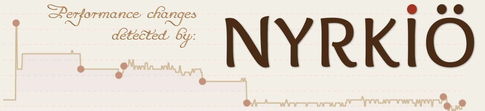

<p align="center">
  
  <h1 align="center">Turso Database</h1>
</p>

<p align="center">
  An in-process SQL database, compatible with SQLite.
</p>

<p align="center">
  <a title="Build Status" target="_blank" href="https://github.com/tursodatabase/turso/actions/workflows/rust.yml"></a>
  <a title="Releases" target="_blank" href="https://github.com/tursodatabase/turso/releases"></a>
  <a title="Rust" target="_blank" href="https://crates.io/crates/turso"></a>
  <a title="JavaScript" target="_blank" href="https://www.npmjs.com/package/@tursodatabase/database"></a>
  <a title="Python" target="_blank" href="https://pypi.org/project/pyturso/"></a>
  <a title="MIT" target="_blank" href="https://github.com/tursodatabase/turso/blob/main/LICENSE.md"></a>
  <br>
  <a title="GitHub Pull Requests" target="_blank" href="https://github.com/tursodatabase/turso/pulls"></a>
  <a title="GitHub Commits" target="_blank" href="https://github.com/tursodatabase/turso/commits/main"></a>
  <a title="Last Commit" target="_blank" href="https://github.com/tursodatabase/turso/commits/main"></a>
</p>
<p align="center">
  <a title="Developer's Discord" target="_blank" href="https://discord.gg/jgjmyYgHwB"></a>
</p>
<p align="center">
  <a title="Users's Discord" target="_blank" href="https://tur.so/discord"></a>
</p>

---

## About

Turso Database is an in-process SQL database written in Rust, compatible with SQLite.

> **⚠️ Warning:** This software is ALPHA, only use for development, testing, and experimentation. We are working to make it production ready, but do not use it for critical data right now.
> 
## Features and Roadmap

* **SQLite compatibility** for SQL dialect, file formats, and the C API [see [document](COMPAT.md) for details]
* **Change data capture (CDC)** for real-time tracking of database changes.
* **Language support** for
  * [Go](bindings/go)
  * [JavaScript](bindings/javascript)
  * [Java](bindings/java)
  * [Python](bindings/python)
  * [Rust](bindings/rust)
  * [WebAssembly](bindings/javascript)
* **Asynchronous I/O** support on Linux with `io_uring`
* **Cross-platform** support for Linux, macOS, Windows and browsers (through WebAssembly)
* **Vector support** support including exact search and vector manipulation
* **Improved schema management** including extended `ALTER` support and faster schema changes.

The database has the following experimental features:

* **`BEGIN CONCURRENT`** for improved write throughput using multi-version concurrency control (MVCC).
* **Incremental computation** using DBSP for incremental view mainatenance and query subscriptions.

The following features are on our current roadmap:

* **Vector indexing** for fast approximate vector search, similar to [libSQL vector search](https://turso.tech/vector).

## Getting Started

Please see the [Turso Database Manual](docs/manual.md) for more information.

<details>
<summary>💻 Command Line</summary>
<br>
You can install the latest `turso` release with:

```shell
curl --proto '=https' --tlsv1.2 -LsSf \
  https://github.com/tursodatabase/turso/releases/latest/download/turso_cli-installer.sh | sh
```

Then launch the interactive shell:

```shell
$ tursodb
```

This will start the Turso interactive shell where you can execute SQL statements:

```console
Turso
Enter ".help" for usage hints.
Connected to a transient in-memory database.
Use ".open FILENAME" to reopen on a persistent database
turso> CREATE TABLE users (id INT, username TEXT);
turso> INSERT INTO users VALUES (1, 'alice');
turso> INSERT INTO users VALUES (2, 'bob');
turso> SELECT * FROM users;
1|alice
2|bob
```

You can also build and run the latest development version with:

```shell
cargo run
```

If you like docker, we got you covered. Simply run this in the root folder:

```bash
make docker-cli-build && \
make docker-cli-run
```

### MCP Server Mode

The Turso CLI includes a built-in [Model Context Protocol (MCP)](https://modelcontextprotocol.io/) server that allows AI assistants to interact with your databases. Start the MCP server with:

```shell
tursodb your_database.db --mcp
```

The MCP server provides seven tools for database interaction:

#### Available Tools

1. **`list_tables`** - List all tables in the database
2. **`describe_table`** - Describe the structure of a specific table
3. **`execute_query`** - Execute read-only SELECT queries
4. **`insert_data`** - Insert new data into tables
5. **`update_data`** - Update existing data in tables
6. **`delete_data`** - Delete data from tables
7. **`schema_change`** - Execute schema modification statements (CREATE TABLE, ALTER TABLE, DROP TABLE)

#### Example Usage

The MCP server runs as a single process that handles multiple JSON-RPC requests over stdin/stdout. Here's how to interact with it:

#### Example with In-Memory Database

```bash
cat << 'EOF' | tursodb --mcp
{"jsonrpc": "2.0", "id": 1, "method": "initialize", "params": {"protocolVersion": "2024-11-05", "capabilities": {}, "clientInfo": {"name": "client", "version": "1.0"}}}
{"jsonrpc": "2.0", "id": 2, "method": "tools/call", "params": {"name": "schema_change", "arguments": {"query": "CREATE TABLE users (id INTEGER, name TEXT, email TEXT)"}}}
{"jsonrpc": "2.0", "id": 3, "method": "tools/call", "params": {"name": "list_tables", "arguments": {}}}
{"jsonrpc": "2.0", "id": 4, "method": "tools/call", "params": {"name": "insert_data", "arguments": {"query": "INSERT INTO users VALUES (1, 'Alice', 'alice@example.com')"}}}
{"jsonrpc": "2.0", "id": 5, "method": "tools/call", "params": {"name": "execute_query", "arguments": {"query": "SELECT * FROM users"}}}
EOF
```

#### Example with Existing Database

```bash
# Working with an existing database file
cat << 'EOF' | tursodb mydb.db --mcp
{"jsonrpc": "2.0", "id": 1, "method": "initialize", "params": {"protocolVersion": "2024-11-05", "capabilities": {}, "clientInfo": {"name": "client", "version": "1.0"}}}
{"jsonrpc": "2.0", "id": 2, "method": "tools/call", "params": {"name": "list_tables", "arguments": {}}}
EOF
```
</details>

<details>
<summary>🦀 Rust</summary>
<br>

```console
cargo add turso
```

Example usage:

```rust
let db = Builder::new_local("sqlite.db").build().await?;
let conn = db.connect()?;

let res = conn.query("SELECT * FROM users", ()).await?;
```
</details>

<details>
<summary>✨ JavaScript</summary>
<br>

```console
npm i @tursodatabase/database
```

Example usage:

```js
import { connect } from '@tursodatabase/database';

const db = await connect('sqlite.db');
const stmt = db.prepare('SELECT * FROM users');
const users = stmt.all();
console.log(users);
```
</details>

<details>
<summary>🐍 Python</summary>
<br>

```console
pip install pyturso
```

Example usage:

```python
import turso

con = turso.connect("sqlite.db")
cur = con.cursor()
res = cur.execute("SELECT * FROM users")
print(res.fetchone())
```
</details>

<details>
<summary>🦫 Go</summary>
<br>

1. Clone the repository
2. Build the library and set your LD_LIBRARY_PATH to include turso's target directory
```console
cargo build --package limbo-go
export LD_LIBRARY_PATH=/path/to/limbo/target/debug:$LD_LIBRARY_PATH
```
3. Use the driver

```console
go get github.com/tursodatabase/turso
go install github.com/tursodatabase/turso
```

Example usage:
```go
import (
    "database/sql"
    _ "github.com/tursodatabase/turso"
)

conn, _ = sql.Open("sqlite3", "sqlite.db")
defer conn.Close()

stmt, _ := conn.Prepare("select * from users")
defer stmt.Close()

rows, _ = stmt.Query()
for rows.Next() {
    var id int
    var username string
    _ := rows.Scan(&id, &username)
    fmt.Printf("User: ID: %d, Username: %s\n", id, username)
}
```
</details>

<details>

<summary>☕️ Java</summary>
<br>

We integrated Turso Database into JDBC. For detailed instructions on how to use Turso Database with java, please refer to
the [README.md under bindings/java](bindings/java/README.md).
</details>

## Contributing

We'd love to have you contribute to Turso Database! Please check out the [contribution guide] to get started.

### Found a data corruption bug? Get up to $1,000.00

SQLite is loved because it is the most reliable database in the world. The next evolution of SQLite has
to match or surpass this level of reliability. Turso is built with [Deterministic Simulation Testing](simulator/)
from the ground up, and is also tested by [Antithesis](https://antithesis.com).

Even during Alpha, if you find a bug that leads to a data corruption and demonstrate
how our simulator failed to catch it, you can get up to $1,000.00. As the project matures we will
increase the size of the prize, and the scope of the bugs.

More details [here](https://turso.algora.io).

You can see an example of an awarded case on [#2049](https://github.com/tursodatabase/turso/issues/2049).

Turso core staff are not eligible.


## FAQ

### Is Turso Database ready for production use?

Turso Database is currently under heavy development and is **not** ready for production use.

### How is Turso Database different from Turso's libSQL?

Turso Database is a project to build the next evolution of SQLite in Rust, with a strong open contribution focus and features like native async support, vector search, and more. The libSQL project is also an attempt to evolve SQLite in a similar direction, but through a fork rather than a rewrite.

Rewriting SQLite in Rust started as an unassuming experiment, and due to its incredible success, replaces libSQL as our intended direction. At this point, libSQL is production ready, Turso Database is not - although it is evolving rapidly. More details [here](https://turso.tech/blog/we-will-rewrite-sqlite-and-we-are-going-all-in).

## Publications

* Pekka Enberg, Sasu Tarkoma, Jon Crowcroft Ashwin Rao (2024). Serverless Runtime / Database Co-Design With Asynchronous I/O. In _EdgeSys ‘24_. [[PDF]](https://penberg.org/papers/penberg-edgesys24.pdf)
* Pekka Enberg, Sasu Tarkoma, and Ashwin Rao (2023). Towards Database and Serverless Runtime Co-Design. In _CoNEXT-SW ’23_. [[PDF](https://penberg.org/papers/penberg-conext-sw-23.pdf)] [[Slides](https://penberg.org/papers/penberg-conext-sw-23-slides.pdf)]

## License

This project is licensed under the [MIT license].

### Contribution

Unless you explicitly state otherwise, any contribution intentionally submitted
for inclusion in Turso Database by you, shall be licensed as MIT, without any additional
terms or conditions.

[contribution guide]: CONTRIBUTING.md
[MIT license]: LICENSE.md

## Partners

Thanks to all the partners of Turso!

<a href="https://antithesis.com/"></a>

<a href="https://blacksmith.sh"></a>

<a href="https://nyrkio.com/"></a>

## Contributors

Thanks to all the contributors to Turso Database!

<a href="https://github.com/tursodatabase/turso/graphs/contributors">
  
</a>
