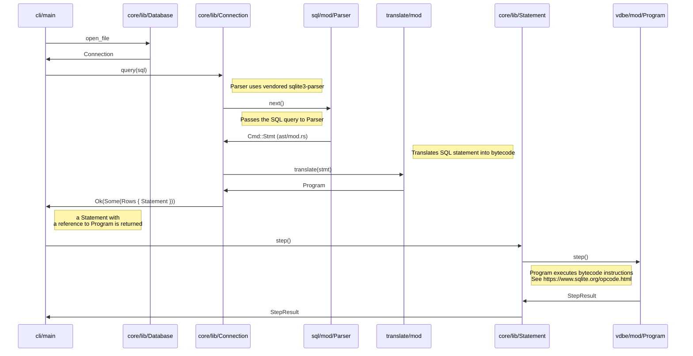

# Turso Database Manual

Welcome to Turso database manual!

## Table of contents

* [Introduction](#introduction)
  * [Getting Started](#getting-started)
  * [Limitations](#limitations)
* [The SQL language](#the-sql-language)
  * [`ALTER TABLE` — change table definition](#alter-table--change-table-definition)
  * [`BEGIN TRANSACTION` — start a transaction](#begin-transaction--start-a-transaction)
  * [`COMMIT TRANSACTION` — commit the current transaction](#commit-transaction--commit-the-current-transaction)
  * [`CREATE INDEX` — define a new index](#create-index--define-a-new-index)
  * [`CREATE TABLE` — define a new table](#create-table--define-a-new-table)
  * [`DELETE` - delete rows from a table](#delete---delete-rows-from-a-table)
  * [`DROP INDEX` - remove an index](#drop-index---remove-an-index)
  * [`DROP TABLE` — remove a table](#drop-table--remove-a-table)
  * [`END TRANSACTION` — commit the current transaction](#end-transaction--commit-the-current-transaction)
  * [`INSERT` — create new rows in a table](#insert--create-new-rows-in-a-table)
  * [`ROLLBACK TRANSACTION` — abort the current transaction](#rollback-transaction--abort-the-current-transaction)
  * [`SELECT` — retrieve rows from a table](#select--retrieve-rows-from-a-table)
  * [`UPDATE` — update rows of a table](#update--update-rows-of-a-table)
* [JavaScript API](#javascript-api)
* [SQLite C API](#sqlite-c-api)
  * [WAL manipulation](#wal-manipulation)
    * [`libsql_wal_frame_count`](#libsql_wal_frame_count)
* [SQL Commands](#sql-commands)
* [Appendix A: Turso Internals](#appendix-a-turso-internals)
  * [Frontend](#frontend)
    * [Parser](#parser)
    * [Code generator](#code-generator)
    * [Query optimizer](#query-optimizer)
  * [Virtual Machine](#virtual-machine)
  * [Pager](#pager)
  * [I/O](#io)

## Introduction

Turso is an in-process relational database engine, aiming towards full compatibility with SQLite.

Unlike client-server database systems such as PostgreSQL or MySQL, which require applications to communicate over network protocols for SQL execution,
an in-process database is in your application memory space.
This embedded architecture eliminates network communication overhead, allowing for the best case of low read and write latencies in the order of sub-microseconds.

### Getting Started

You can install Turso on your computer as follows:

```
curl --proto '=https' --tlsv1.2 -LsSf \
  https://github.com/tursodatabase/turso/releases/latest/download/turso_cli-installer.sh | sh
```

When you have the software installed, you can start a SQL shell as follows:

```console
$ turso
Turso
Enter ".help" for usage hints.
Connected to a transient in-memory database.
Use ".open FILENAME" to reopen on a persistent database
turso> SELECT 'hello, world';
hello, world
```

## Limitations

Turso aims towards full SQLite compatibility but has the following limitations:

* No multi-process access
* No multi-threading
* No indexing
* No savepoints
* No triggers
* No views
* No vacuum
* UTF-8 is the only supported character encoding

For more detailed list of SQLite compatibility, please refer to [COMPAT.md](../COMPAT.md).

## The SQL language

### `ALTER TABLE` — change table definition

**Synopsis:**

```sql
ALTER TABLE old_name RENAME TO new_name

ALTER TABLE table_name ADD COLUMN column_name [ column_type ]

ALTER TABLE table_name DROP COLUMN column_name
```

**Example:**

```console
turso> CREATE TABLE t(x);
turso> .schema t;
CREATE TABLE t (x);
turso> ALTER TABLE t ADD COLUMN y TEXT;
turso> .schema t
CREATE TABLE t ( x , y TEXT );
turso> ALTER TABLE t DROP COLUMN y;
turso> .schema t
CREATE TABLE t ( x  );
```

### `BEGIN TRANSACTION` — start a transaction

**Synopsis:**

```sql
BEGIN [ transaction_mode ] [ TRANSACTION ]
```

where `transaction_mode` is one of the following:

* `DEFERRED`
* `IMMEDIATE`
* `EXCLUSIVE`

**See also:**

* [END TRANSACTION](#end-transaction--commit-the-current-transaction)

### `COMMIT TRANSACTION` — commit the current transaction

**Synopsis:**

```sql
COMMIT [ TRANSACTION ]
```

**See also:**

* [END TRANSACTION](#end-transaction--commit-the-current-transaction)

### `CREATE INDEX` — define a new index

> [!NOTE]  
> Indexes are currently experimental in Turso and not enabled by default.

**Synopsis:**

```sql
CREATE INDEX [ index_name ] ON table_name ( column_name )
```

**Example:**

```
turso> CREATE TABLE t(x);
turso> CREATE INDEX t_idx ON t(x);
```

### `CREATE TABLE` — define a new table

**Synopsis:**

```sql
CREATE TABLE table_name ( column_name [ column_type ], ... )
```

**Example:**

```console
turso> DROP TABLE t;
turso> CREATE TABLE t(x);
turso> .schema t
CREATE TABLE t (x);
```

### `DELETE` - delete rows from a table

**Synopsis:**

```sql
DELETE FROM table_name [ WHERE expression ]
```

**Example:**

```console
turso> DELETE FROM t WHERE x > 1;
```

### `DROP INDEX` - remove an index

> [!NOTE]  
> Indexes are currently experimental in Turso and not enabled by default.

**Example:**

```console
turso> DROP INDEX idx;
```

### `DROP TABLE` — remove a table

**Example:**

```console
turso> DROP TABLE t;
```

### `END TRANSACTION` — commit the current transaction

```sql
END [ TRANSACTION ]
```

**See also:**

* `COMMIT TRANSACTION`

### `INSERT` — create new rows in a table

**Synopsis:**

```sql
INSERT INTO table_name [ ( column_name, ... ) ] VALUES ( value, ... ) [, ( value, ... ) ...]
```

**Example:**

```
turso> INSERT INTO t VALUES (1), (2), (3);
turso> SELECT * FROM t;
┌───┐
│ x │
├───┤
│ 1 │
├───┤
│ 2 │
├───┤
│ 3 │
└───┘
```

### `ROLLBACK TRANSACTION` — abort the current transaction

```sql
ROLLBACK [ TRANSACTION ]
```

### `SELECT` — retrieve rows from a table

**Synopsis:**

```sql
SELECT expression
    [ FROM table-or-subquery ]
    [ WHERE condition ]
    [ GROU BY expression ]
```

**Example:**

```console
turso> SELECT 1;
┌───┐
│ 1 │
├───┤
│ 1 │
└───┘
turso> CREATE TABLE t(x);
turso> INSERT INTO t VALUES (1), (2), (3);
turso> SELECT * FROM t WHERE x >= 2;
┌───┐
│ x │
├───┤
│ 2 │
├───┤
│ 3 │
└───┘
```

### `UPDATE` — update rows of a table

**Synopsis:**

```sql
UPDATE table_name SET column_name = value [WHERE expression]
```

**Example:**

```console
turso> CREATE TABLE t(x);
turso> INSERT INTO t VALUES (1), (2), (3);
turso> SELECT * FROM t;
┌───┐
│ x │
├───┤
│ 1 │
├───┤
│ 2 │
├───┤
│ 3 │
└───┘
turso> UPDATE t SET x = 4 WHERE x >= 2;
turso> SELECT * FROM t;
┌───┐
│ x │
├───┤
│ 1 │
├───┤
│ 4 │
├───┤
│ 4 │
└───┘
```

## JavaScript API

Turso supports a JavaScript API, both with native and WebAssembly package options.

### Installation

Installing the native package:

```console
npm i @tursodatabase/turso
```

Installing the WebAssembly package:

```console
npm i @tursodatabase/turso --cpu wasm32
```

### API reference

See [JavaScript API reference](docs/javascript-api-reference.md) for more information.

### Getting Started

To use Turso from JavaScript application, you need to import `Database` type from the `@tursodatabase/turso` package.
You can the prepare a statement with `Database.prepare` method and execute the SQL statement with `Statement.get()` method.

```
import Database from '@tursodatabase/turso';

const db = new Database('turso.db');
const row = db.prepare('SELECT 1').get();
console.log(row);
```

## SQLite C API

Turso supports the SQLite C API, with libSQL extensions.

### WAL manipulation

#### `libsql_wal_frame_count`

Get the number of frames in the WAL.

**Synopsis:**

```c
int libsql_wal_frame_count(sqlite3 *db, uint32_t *p_frame_count);
```

**Description:**

The `libsql_wal_frame_count` function returns the number of frames in the WAL
in the `p_frame_count` parameter.

**Return Values:**

* `SQLITE_OK` if the number of frames in the WAL file is successfully returned.
* `SQLITE_MISUSE` if the `db` is NULL.
* SQLITE_ERROR if an error occurs while getting the number of frames in the WAL
  file.

**Safety Requirements:**

* The `db` parameter must be a valid pointer to a `sqlite3` database
  connection.
* The `p_frame_count` must be a valid pointer to a `u32` that will store the
* number of frames in the WAL file.

## SQL Commands

## Appendix A: Turso Internals

Turso's architecture resembles SQLite's but differs primarily in its
asynchronous I/O model. This asynchronous design enables applications to
leverage modern I/O interfaces like `io_uring,` maximizing storage device
performance. While an in-process database offers significant performance
advantages, integration with cloud services remains crucial for operations
like backups. Turso's asynchronous I/O model facilitates this by supporting
networked storage capabilities.

The high-level interface to Turso is the same as in SQLite:

* SQLite query language
* The `sqlite3_prepare()` function for translating SQL statements to programs
  ("prepared statements")
* The `sqlite3_step()` function for executing programs

If we start with the SQLite query language, you can use the `turso`
command, for example, to evaluate SQL statements in the shell:

```
turso> SELECT 'hello, world';
hello, world
```

To execute this SQL statement, the shell uses the `sqlite3_prepare()`
interface to parse the statement and generate a bytecode program, a step
called preparing a statement. When a statement is prepared, it can be executed
using the `sqlite3_step()` function.

To illustrate the different components of Turso, we can look at the sequence
diagram of a query from the CLI to the bytecode virtual machine (VDBE):



To drill down into more specifics, we inspect the bytecode program for a SQL
statement using the `EXPLAIN` command in the shell. For our example SQL
statement, the bytecode looks as follows:

```
turso> EXPLAIN SELECT 'hello, world';
addr  opcode             p1    p2    p3    p4             p5  comment
----  -----------------  ----  ----  ----  -------------  --  -------
0     Init               0     4     0                    0   Start at 4
1     String8            0     1     0     hello, world   0   r[1]='hello, world'
2     ResultRow          1     1     0                    0   output=r[1]
3     Halt               0     0     0                    0
4     Transaction        0     0     0                    0
5     Goto               0     1     0                    0
```

The instruction set of the virtual machine consists of domain specific
instructions for a database system. Every instruction consists of an
opcode that describes the operation and up to 5 operands. In the example
above, execution starts at offset zero with the `Init` instruction. The
instruction sets up the program and branches to a instruction at address
specified in operand `p2`. In our example, address 4 has the
`Transaction` instruction, which begins a transaction. After that, the
`Goto` instruction then branches to address 1 where we load a string
constant `'hello, world'` to register `r[1]`. The `ResultRow` instruction
produces a SQL query result using contents of `r[1]`. Finally, the
program terminates with the `Halt` instruction.

### Frontend

#### Parser

The parser is the module in the front end that processes SQLite query language input data, transforming it into an abstract syntax tree (AST) for further processing. The parser is an in-tree fork of [lemon-rs](https://github.com/gwenn/lemon-rs), which in turn is a port of SQLite parser into Rust. The emitted AST is handed over to the code generation steps to turn the AST into virtual machine programs.

#### Code generator

The code generator module takes AST as input and produces virtual machine programs representing executable SQL statements. At high-level, code generation works as follows:

1. `JOIN` clauses are transformed into equivalent `WHERE` clauses, which simplifies code generation.
2. `WHERE` clauses are mapped into bytecode loops
3. `ORDER BY` causes the bytecode program to pass result rows to a sorter before returned to the application.
4. `GROUP BY` also causes the bytecode programs to pass result rows to an aggregation function before results are returned to the application.
  
#### Query optimizer

### Virtual Machine

### Pager

TODO

### I/O

TODO

[SQLite]: https://www.sqlite.org/
